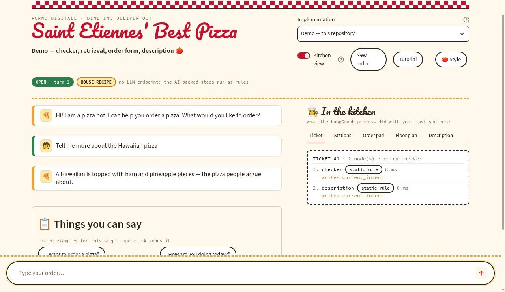

:toc:
:toclevels: 5
:toc-placement!:
:source-highlighter: highlight.js
ifdef::env-github[]
:tip-caption: :bulb:
:note-caption: :information_source:
:important-caption: :heavy_exclamation_mark:
:caution-caption: :fire:
:warning-caption: :warning:
:github-repository: https://github.com/WSE-research/pizzabot
endif::[]

++++
<!-- the bot's own mark: the slice the frontend uses as its avatar, rendered
     from the emoji so it looks the same here as it does in the app. The WSE
     cube is beside the attribution below, and in the footer of the app. -->

++++

= Pizza Bot

Order a pizza, slot by slot — a task-oriented dialog process built with https://langchain-ai.github.io/langgraph/[LangGraph], behind a web frontend that will host *any* LangGraph implementation and explain it while it runs.

 A teaching tool of the https://wse-research.org/[Web & Software Engineering research group] at https://www.htwk-leipzig.de/[Leipzig University of Applied Sciences (HTWK Leipzig, Germany)], written for the *Question Answering & Chatbots* course.

A dialog system is easy to demonstrate and hard to teach: the interesting part — which node ran, what it wrote, why the process took that edge — happens where nobody can see it. This frontend puts that part on the screen beside the conversation, and it reads all of it out of the *compiled graph*, so it is true of whatever implementation is loaded rather than of this one bot.

That is the whole point of the repository: students write their own `build_graph()` in their own repository, add one line to `apps.json`, and get a shop front, a process picture, a per-turn trace and a state inspector for code the frontend has never seen.

* *One frontend, many bots* — `apps.json` lists implementations; the picker in the header switches between them live, mid-lecture, without a restart.
* *Nothing is hard-coded* — nodes, edges, the entry point, the state schema, what each node did this turn and how long it took all come from the compiled graph. A node's purpose comes from its docstring.
* *The process, drawn* — the model is generated on load from `get_graph()` and cached under a hash of its structure. Change the graph, get a new picture; change nothing, pay nothing.
* *Your bug, where you can read it* — a node that raises answers in the conversation and adds a red row to the ticket; the app stays alive. An entry that cannot be loaded is listed with the reason instead of vanishing.
* *It is somebody's pizzeria* — the name over the door and one of five styles are asked once and kept in cookies. Styles are data, not CSS.
* *Runs with no LLM at all* — `PIZZABOT_OFFLINE=1` swaps each AI-backed step for a deterministic rule of the same signature, so a demo survives a room with no VPN, no key and no network — and a fresh checkout runs before anyone has configured anything.
* *A guided tour* — eleven steps over the real interface on a first visit, and from a button afterwards.

'''

toc::[]

'''

== Feature overview

|===
|Area |Highlights

|The counter
|The conversation, and under it a board of example inputs *known to work with the loaded implementation*, filtered by the step the dialog is in — one click sends them, the tooltip says what each demonstrates. Messages are served one at a time, 500 ms apart. *New order* fades the counter out, holds it empty for half a second and lets the bot greet again.

|The kitchen view
|Five tabs, all filled from the compiled graph. *Ticket*: the nodes that ran for the last sentence, in order, with their timings and the state keys each one wrote — read from `stream(..., stream_mode="updates")`, so it is what actually happened, not what should have. *Stations*: one card per node — what it does, where it routes, which service it calls, how it fails, where its code lives. *Order pad*: the state after the turn, filled values highlighted. *Floor plan*: the process model. *What happened*: the turn in plain language — the implementation's own account if it offers `what_happened(target)`, otherwise one assembled from the run and labelled as such.

|The picker
|Every entry of `apps.json` that can be loaded, by title. Switching re-imports the module, so two implementations may share a top-level package name. Entries that cannot be loaded are listed underneath with the reason (`mine (path not found: …)`), which is faster than reading a traceback.

|The shop front
|The sign is a button: click it to rename the pizzeria. Beside the kitchen-view switch sit *New order*, *Tutorial* and *Style*. Name and style live in cookies, so they survive a reload but never reach a server.

|Five styles
|`trattoria`, `notte`, `marina`, `neon`, `bianco` — each a palette, three font stacks, six icons and the sign's metrics. The chooser previews them by *being* them: a card is painted in the style it offers.

|Offline mode
|Intent check, address extraction and pizza description each have a rule twin behind the same contract — same input, same output, same defined failure. `run_local.sh` probes the endpoint and turns the mode on by itself; the header then says *HOUSE RECIPE*.

|The tour
|The page dims, the element a step talks about is cut out of the veil and outlined, a card explains it. Steps are data — a selector, a title, a sentence — addressing the element ids below, so a step is one dictionary and no other change.

|Element identity
|Every element carries an `id` from its container key and a class for its kind, re-applied after each rerender — so CSS, the tour and a test can all address *one* control by name rather than by position.
|===

== Your pizzeria: the name and the five styles

The bot belongs to the course; the shop belongs to whoever opens it. On a first visit the app does not go to the counter at all — it asks two questions. *What is your pizzeria called?* goes over the door as “&lt;name&gt;’s Pizza Bot”, into the browser tab and onto the receipt, with the sign shown under the input while you type. *Pick a style* offers five cards, each painted in the style it offers, so what you see on the welcome screen is what you get at the counter.

Both are remembered in the cookies `pizzabot_shop` and `pizzabot_style`, read back through `st.context.cookies` when the session connects — asked once per browser, not once per reload. Afterwards, clicking the sign opens *The name over the door* and the *Style* button opens *How the shop looks*; the button carries the current style's icon, so the header says which one is on.

|===
|Key |Style |Palette |Display · body · mono |Icons

|`trattoria` |the house look |dough, tomato, basil |Pacifico · Source Sans 3 · Source Code Pro |🍕 🧑 🍅
|`notte` |the late shift, dark |charcoal, ember orange |Bebas Neue · Inter · JetBrains Mono |🌜 🧑‍🍳 🔥
|`marina` |the seaside terrace |white, azure, lemon |Playfair Display · Karla · IBM Plex Mono |🍋 ⛵ 🌊
|`neon` |the late-night arcade, dark |violet, magenta, cyan |Monoton · Space Grotesk · Space Mono |🤖 🕹 ⚡
|`bianco` |the quiet one, for a bright room |stone, olive, paper |Fraunces · IBM Plex Sans · IBM Plex Mono |🫒 🧑‍🎨 🌾
|===

A style is *data*: a dictionary in `shopfront.py` with a palette, three font stacks, the sign's metrics and a set of icons. `shopfront.css()` writes it as the `:root` block of the page, and every rule in `streamlit_chat.py` reads it from there — `--dough` the page, `--paper` a card, `--char` the ink, `--tomato` the accent, `--font-display` / `--font-body` / `--font-mono` the type. A sixth style is one dictionary and no CSS.

Streamlit paints its own widgets from `.streamlit/config.toml`, which is one palette and not five, so inputs, buttons, selects and dialogs are repainted from the same variables. That is what the `!important` block in `STYLE` is for, and it is the only reason the dark styles are readable. The guided tour reads the same variables, so it is dressed in whatever style is on.

== Working in the kitchen view

The pane on the right is where a lecture spends most of its time, so it can be shaped to the room and to the question at hand.

=== Its width

The slider *Width of the kitchen view* under the pane's heading sets how much of the page the pane takes, from 25 % to 70 % in steps of five; the conversation gets the rest. The default, 40 %, is the old fixed 3 : 2 split. Narrow it in front of an audience that should watch the conversation, widen it to read a long prompt. The value is kept for the session and written into the address bar as `?kitchen=55`, so a bookmark or a link handed to a student opens with the same layout; the default is left out of the address.

=== The size of the floor plan

The *Floor plan* tab has a slider of its own, *Size of the floor plan*, from 50 % to 300 % of the pane's width. Up to 100 % the picture is shown whole; beyond that it keeps a fixed frame of about three quarters of the screen's height and scrolls inside it, both ways, so a large graph can be read node by node without the page itself growing sideways. SVG and PNG pictures scale alike. Like the width, the size is kept for the session and in the address bar (`?plan=200`).

== Architecture

One Streamlit page, a loader, a diagram generator and the demo bot. No build step, no framework, and no server between the page and the graph — the app compiles the graph in-process.

[source]
----
streamlit_chat.py     the frontend: counter, kitchen view, example board, picker
app_loader.py         imports an implementation and reads its process model
diagram.py            draws the process model from a compiled graph
settings.py           the only module that reads .env
shopfront.py          the name over the door, the five styles, the welcome screen
tutorial.py           the guided tour: steps as data, and the code that runs it
apps.json             which implementations are offered
frontend_meta/*.json  per-implementation prose and example inputs (data, not code)
pizzabot.py           the demo process: state, four nodes, build_graph(), console loop
utils.py              the outside world: Pizza API, LLM, Qanary — and the rule twins
run_local.sh          venv, .env, service probes, implementation listing, start
.streamlit/           theme (dough, tomato, charcoal)
----

Three decisions carry the design:

* *The frontend never imports a bot.* It imports whatever `apps.json` names, with that entry's path on `sys.path` and its `env` applied first, and then asks the object questions. A frontend that knew a node name would contradict the very contract the lecture argues for.
* *Derived beats declared.* Anything that can be read from the compiled graph is read from it and never written down twice — nodes, edges, the entry point, the state schema, the trace, the picture. Only what genuinely cannot be derived is data: a sentence per node, and the example inputs with the state condition under which each applies.
* *A failure is a view, not a stack trace.* A node that raises is caught per turn; an entry that will not load is listed with its reason; a graph that says nothing is reported as having said nothing. The demo must not die in front of a room.

=== The contract between frontend and implementation

An implementation is a Python module that offers:

[source, python]
----
def build_graph():                 # required -- returns a COMPILED LangGraph
    ...

def new_state(user_input=""):      # optional -- the initial state
    ...

def what_happened(target):         # optional -- the turn in plain language
    ...
----

Everything else is discovered:

|===
|The UI shows |Where it comes from

|nodes, edges, entry point |`compiled.get_graph()`
|what ran this turn |`compiled.stream(..., stream_mode="updates")`
|state keys |the graph's state schema (`state_schema` / `schema`)
|what a node is *for* |the node function's docstring
|rule / LLM / service |the node's own source, one level deep into the helpers it calls
|the answer |the new messages in the state, else `answer` / `response` / `output`
|the picture |generated from the graph
|===

`new_state` may also live in the package or in a `state` module beside it, as in the course exercises. When the implementation has none, the frontend builds the initial state from the schema.

`what_happened(target)` is the *What happened* tab. `target` is the IRI of the current user input — the state key named by `target_key` in the sidecar file, `input_iri` by default; a bot without such a key is handed the state instead. It may return one string (one sentence per line), a list of strings, or a list of dictionaries with a `sentence` key. `explain` and `explanation` are accepted as names too. A bot that records a process knowledge graph — one annotation per request to a component, carrying who was asked, what it was given, what it returned and how sure it was — verbalizes that graph here. A bot that does not gets an account assembled from the run instead, with a note saying so: that text is the frontend talking, not the process.

=== Registering an implementation

[source, json]
----
{"key": "l4", "title": "L4 — KGQA", "module": "pizzabot.graph",
 "path": "${L4_PATH}", "env": {"BOT_CONFIG": "static"}, "meta": "l4"}
----

`path` may use `${VAR}` from `.env`, and `env` sets variables *before* the module is imported — which is how one implementation with two configurations becomes two entries rather than two copies of the code. Implementations that share a top-level package name are unloaded before the next is imported, so `pizzabot` here and `pizzabot` in an exercise can live in one process.

=== The example inputs

Each entry in `+frontend_meta/*.json+` may declare when it applies:

[source, json]
----
{"label": "Give the address", "text": "deliver it to 5 Rue Michelet, Saint-Étienne",
 "shows": "address_recognition + validation by the Pizza API",
 "when": {"expected": "address", "ended": false}, "requires": ["address_recognition"]}
----

`when` is evaluated against the live state (dotted paths, `set` / `unset` / a literal), `requires` against the node names of the loaded graph.

== Plugging in your own LangGraph implementation

The frontend is not a wrapper you copy and change; it is a *host*. Your implementation stays where it is, in your own repository, and the frontend loads it. Six steps.

=== Step 1 — satisfy the contract

Somewhere in your package there has to be one importable module offering `build_graph()`, returning a *compiled* graph:

[source, python]
----
# yourbot/graph.py
def build_graph():
    workflow = StateGraph(YourState)
    ...
    return workflow.compile()          # compiled, not the builder
----

That is the whole obligation. Nothing in your code imports anything from the frontend — if it does, the seam is in the wrong place.

=== Step 2 — tell `.env` where your repository is

[source]
----
MYBOT_PATH=/home/me/git/my-pizzabot
----

The path is the directory `import yourbot.graph` works from — the one you would put on `PYTHONPATH`, not the package folder itself.

=== Step 3 — add one line to `apps.json`

[source, json]
----
{"key": "mine", "title": "My bot — iteration 4", "module": "yourbot.graph",
 "path": "${MYBOT_PATH}", "env": {"BOT_CONFIG": "static"}, "meta": "mine",
 "note": "router / kgqa / order_form"}
----

`key` is what `PIZZABOT_APP` and `run_local.sh --app` take, `title` is what the picker shows. Nothing else in the frontend changes — no Python, no CSS.

=== Step 4 — start it and pick it

[source, bash]
----
./run_local.sh --app mine
----

The script checks the environment, the Pizza API and the LLM endpoint first, then serves the UI on http://localhost:8501[localhost:8501].

=== Step 5 — read what the UI now says about your graph

Everything in the kitchen pane is read from *your* compiled graph, so it is a free review of what you built: *Stations* lists your nodes with their docstrings, *Floor plan* is your process model from `get_graph()`, *Ticket* is the nodes that really ran, in order, with what each one wrote. If a node shows the wrong chip — `static rule` where you call a model — the guess came from your node's own source; override it in the sidecar of the next step.

=== Step 6 — optional: the prose and the example inputs

What cannot be derived is data, in `frontend_meta/mine.json` (the name comes from `meta` in `apps.json`) or in a `FRONTEND` dict exported by your module: a sentence per node, the station name, the services it calls, how it fails — and the example sentences the board offers. Still no Python.

=== What happens when you change your implementation

*Nothing, until you say so* — and this is the one thing worth knowing before a practical session. The frontend keeps the compiled graph in `@st.cache_resource`, which lives as long as the *server process*, and Streamlit's file watcher only watches files under the frontend's own folder. Your repository is outside it. Measured on Streamlit 1.64:

|===
|You do this |Your change is picked up

|save your file, send another sentence |*no* — same compiled graph
|save your file, reload the browser (F5) |*no* — a reload starts a new _session_, not a new _process_, and the cache is process-wide
|*⋮ → Clear cache* in Streamlit's menu (shortcut `C`) |*yes* — the cached graph is dropped and the next run re-imports your module from disk
|stop and restart `./run_local.sh` |*yes*
|===

So: *no restart is needed, but a reload is not enough.* The loop while you work on your bot is _save → press `C` → confirm → send your sentence again_. Clearing the cache also clears the session, so the conversation starts over and the picker returns to the default — the pizzeria name and the style survive, because those are in cookies and not in the session.

Editing the *frontend's* own files is the ordinary Streamlit loop. One caveat that costs minutes if you do not know it: an edited *imported* module (`shopfront.py`, `tutorial.py`, `app_loader.py`) is only re-imported by the session that saw the change, so a browser reload can keep the old one. When a frontend edit does not seem to arrive, restart the server.

=== What happens when your implementation has a bug

The frontend is written so that your bug is *your* bug, shown where you can read it, and never a blank page. Three cases, all observed:

*A node raises during a turn.* `run_turn` catches it. The bot answers “The process raised an error: …” in the conversation, and the *Ticket* shows the nodes that ran before the failure with their timings, followed by a red `ERROR` row carrying the message. The app stays alive, the state is not advanced, and you can keep typing.

*Your module cannot be imported, or `build_graph()` itself raises.* The load happens before anything can be rendered, so Streamlit shows the exception instead of the page: the type and message first, *with the file and the line in your repository*, then the traceback — the last frames are yours, the first are the frontend's `load_app → app_loader.load → importlib`. Fix the file, then press `C`; no restart.

*The path in `apps.json` is wrong.* Your implementation is not offered at all: the picker lists only what is available, and a grey line under it names the key and the reason. `./run_local.sh --apps` prints the same list without starting anything, which is the faster way to find a typo in `.env`.

Two more shapes are contract violations rather than crashes: `build_graph()` returning the *builder* instead of a compiled graph makes `app_loader` raise while reading the process model, and a graph that produces no message and no `answer` / `response` / `output` key makes the bot say “(nothing to say — see the ticket)” — the frontend telling you that your turn wrote state but never spoke.

== Building and Running

=== Running locally

[source, bash]
----
./run_local.sh
----

One command starts everything. The graph is *not* a separate server — the Streamlit app compiles it in-process — so the script's job is everything that must be true before that works: a virtual environment with the pinned requirements, a `.env` (copied from `.env-example` when missing), a reachable Pizza API, a reachable LLM endpoint (and, when there is none, offline mode), and the implementations from `apps.json` with the reason when one will not load.

|===
|Call |What it does

|`./run_local.sh` |checks, then the web UI on http://localhost:8501[localhost:8501]
|`./run_local.sh --app l3-static` |start with that implementation selected
|`./run_local.sh --apps` |list the implementations and stop
|`./run_local.sh --console` |checks, then the console bot (`pizzabot.py`)
|`./run_local.sh --check` |only the checks, starts nothing — the pre-lecture smoke test
|`./run_local.sh --offline` / `--online` |force the rule implementations / insist on the LLM
|`./run_local.sh --port 8502` |another port
|`./run_local.sh --no-venv` |use the interpreter that is already active
|===

=== Starting it by hand

[source, bash]
----
python3 -m venv .venv
source .venv/bin/activate            # Windows: .venv\Scripts\activate
python -m pip install -r requirements.txt
python pizzabot.py                   # console
streamlit run streamlit_chat.py      # web UI
----

Requires *Python 3.10 or higher*. The pinned stack follows the current course exercises (LangGraph 1.2.11, langchain-core 1.6.2, pydantic 2.13.5), because one environment has to run every implementation the frontend can load.

=== Running without an LLM endpoint

The AI-backed steps — intent check, address extraction, pizza description — need an OpenAI-compatible endpoint. With

[source, bash]
----
PIZZABOT_OFFLINE=1
----

they run as deterministic rules instead (`rule_check_order_intention`, `rule_extract_address`, `rule_generate_pizza_description` in `utils.py`). `run_local.sh` sets it by itself when the endpoint does not answer, and the header says *HOUSE RECIPE* while it is on. Nothing else changes: same graph, same slots, same contracts, same Pizza API, same defined failures. The rule version *is* the static implementation of iteration 1, which is why this is a teaching device and not a fallback hack.

=== An example run, on the console

[source]
----
-- Chatbot:  Hi! I am a pizza bot. I can help you order a pizza. What would you like to order?
-> Your response: I want a pizza
-- Chatbot:  What pizza would you like to order?
Or should I describe the pizza for you? Here are the options: Margherita, Pepperoni, Hawaiian, ...
-> Your response: Hawaiian
-- Chatbot:  What is your delivery address?
-> Your response: Maksim Gorki Str 58, Leipzig
-- Chatbot:  Thank you for providing all the details. Your order is being processed! Keep your order
             id ready incase you have further inquiries: 72ee0f12-ce97-4c2d-9386-e6b40bbb55ff .
----

== Configuration

Everything comes from `.env` (see `.env-example`) — endpoints, credentials, the default implementation, the paths used in `apps.json`. `settings.py` is the only module that reads the environment, so the frontend, the console bot and every loaded implementation can never disagree about what they are talking to.

[source]
----
OPENAI_API_BASE=          # any OpenAI-compatible endpoint, or nothing
OPENAI_API_KEY=           # whatever that endpoint wants
MODEL_NAME=               # a name from its /models
PIZZABOT_OFFLINE=1        # the rules instead of the LLM
PIZZA_API_BASE=https://wse-research.org/pizza-api
QANARY_API_BASE=http://demos.swe.htwk-leipzig.de:40111
PIZZABOT_APP=demo
L3_PATH=/path/to/saint-etienne-exercise-03/student
----

*`.env-example` names no particular LLM.* It is shipped with the three LLM variables empty and `PIZZABOT_OFFLINE=1`, so `./run_local.sh` on a fresh checkout starts a working bot with no key, no endpoint and no account anywhere. Fill the three in — a hosted service, your institution's server, one on your own machine — and `run_local.sh` probes the endpoint and turns offline mode off by itself. A shell `PIZZABOT_OFFLINE` wins over the file, which is how it reports that probe; for everything else the file wins.

`PIZZA_API_BASE` has a built-in default, so even an empty `.env` answers *what pizzas do you have?*. Credentials have no such default: a missing key stays a missing key, and says so.

== The process picture

`diagram.py` generates it when the implementation is loaded, from the graph, and caches it under `assets/generated/` keyed by a hash of the structure. Four ways out, in order: `dot` (graphviz), if the installation can really write SVG or PNG; the built-in layered SVG renderer, which has no dependency and works offline; LangGraph's `draw_mermaid_png()`, which needs the network; and a text diagram. The mermaid source of the loaded graph sits under the picture, ready to paste into a slide deck.

== Addressing elements from CSS or JavaScript

Every element sits in a container with a `key`, which Streamlit renders as the class `+st-key-<key>+`. A small script (`IDENTITY_SCRIPT` in `streamlit_chat.py`) copies that key into the element's `id` and adds a class per element *type*, derived from its `data-testid`. Both are re-applied after every rerender, so one element is `#pz-button-new-order` or `#pz-message-3`, and all elements of a kind are `.pz-el-button` or `.pz-el-chat-message`.

|===
|Id |What it is

|`pz-header`, `pz-brand`, `pz-controls`, `pz-status` |the shop sign, the controls beside it, the status chips
|`pz-button-rename`, `pz-widget-rename` |the sign itself — a button, so a click can open the rename overlay
|`pz-widget-implementation`, `pz-toggle-kitchen-view`, `pz-button-new-order`, `pz-button-tutorial`, `pz-button-style` |the picker and the four controls of the header row (`+pz-widget-*+` is the widget, the other its container)
|`pz-welcome`, `pz-welcome-name`, `pz-welcome-open` |the first-visit screen: the name input and the button that opens the shop
|`+pz-style-<where>-<key>+` |one style card, `<where>` being `welcome` or `dialog`
|`pz-output`, `pz-chat`, `pz-transcript`, `+pz-message-<n>+`, `pz-receipt` |everything the process shows, the conversation column, one message, the receipt
|`pz-examples`, `+pz-example-<n>+` |the menu board and one entry
|`pz-kitchen`, `pz-kitchen-width`, `pz-widget-kitchen-width`, `pz-kitchen-tabs`, `pz-tab-ticket`, `pz-tab-stations`, `pz-tab-order-pad`, `pz-tab-floor-plan`, `pz-floor-plan-size`, `pz-tab-what-happened` |the kitchen pane, its width control, its tabs and the floor plan's size control
|`pz-footer` |the attribution and the link to this repository
|`pz-input`, `pz-input-block`, `pz-widget-chat-input`, `pz-main` |Streamlit's fixed bottom bar, its inner block, the chat input, the scrolling page
|===

The last row are aliases the script puts on elements Streamlit renders itself: the chat input has to stay a direct child of the page, otherwise it leaves the fixed bottom bar and scrolls away with the conversation.

== The guided tour

Once the shop front has been set up — and on every later visit without a `pizzabot_tutorial` cookie — a tour starts by itself. *Skip* (or Esc) ends it and remembers that; *Next / Back* (or the arrow keys) walk through eleven steps, beginning at the sign and ending at the *Style* button. The *Tutorial* button brings it back at any time.

Two details took a moment to get right and are worth knowing before extending it: the tour's code is injected into the *page*, not into a component's iframe, because Streamlit re-mounts component iframes on every rerun and a tour whose buttons live in a destroyed iframe stops responding; and it waits for its first target to exist rather than guessing a delay, because the ids are assigned by a second script and the app paints in its own time.

== External tools

* Pizza API — https://wse-research.org/pizza-api/docs[wse-research.org/pizza-api/docs]. Twenty pizzas, delivering to Leipzig, Halle, Dresden and every commune of France. The menu and the delivery area are read from it, never hard-coded.
* Qanary pipeline, for pizza descriptions out of Wikidata — `QANARY_API_BASE`.

== Contribute

We are happy to receive your contributions. Please create a pull request or an {github-repository}/issues/new[issue]. Published under the {github-repository}/blob/main/LICENSE[MIT license]; feel free to {github-repository}/fork[fork] it.

== Disclaimer

This tool is provided "as is" and without any warranty, express or implied. It is teaching material: it demonstrates how a dialog process is built, observed and explained, and it is not a production ordering system. Orders placed through it reach a demonstration service and no kitchen.
