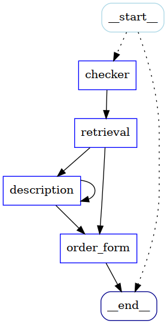

# Python examples

## Pizza Bot (`pizzabot.py`)

A simple chatbot that runs a straightforward conversation for pizza ordering.

The Pizza Bot's dialogue graph is presented below:



### How to run

1. Run `python pizzabot.py`
2. Follow the dialogue in your console

#### `.env` file

```.env
OPENAI_API_KEY=SECRET
MODEL_NAME=CHECK THE AVAILABLE AT http://gpu01.imn.htwk-leipzig.de:8081/v1/models
OPENAI_API_BASE=http://gpu01.imn.htwk-leipzig.de:8081/v1
PIZZA_API_BASE=https://demos.swe.htwk-leipzig.de/pizza-api
QANARY_API_BASE=http://demos.swe.htwk-leipzig.de:40111
```

## External Tools

Pizza API: https://demos.swe.htwk-leipzig.de/pizza-api/docs

## Requirements

Make sure you have:

* Python 3.9 or higher
* Installed the libs from `requirements.txt`

```sh
python3 -m venv pizzabot_env # may be required to install apt install python3.10-venv
source pizzabot_env/bin/activate # activates the venv
python -m pip install -r requirements.txt # now you can use python without "3" when the venv activated
python pizzabot.py # run the application
```

## Example 

Given the current implementation the following interaction should be supported:

```
-- Chatbot:  Hi! I am a pizza bot. I can help you order a pizza. What would you like to order?
-> Your response: I want a pizza
-- Chatbot:  What pizza would you like to order?
Or should I describe the pizza for you? Here are the options: Margherita, Pepperoni, Hawaiian, Quattro Formaggi
-> Your response: Tell me more about Hawaiian
-- Chatbot:  Hawaiian pizza is a variety of pizza usually topped with pineapple pieces and ham.
-> Your response: Thanks
-- Chatbot:  What pizza would you like to order?
Or should I describe the pizza for you? Here are the options: Margherita, Pepperoni, Hawaiian, Quattro Formaggi
-> Your response: Hawaiian
-- Chatbot:  What is your delivery address?
-> Your response: Maksim Gorki Str 58, Leipzig
-- Chatbot:  Thank you for providing all the details. Your order is being processed! Keep your order id ready incase you have further inquiries: f74cbffd-cec6-4f0f-9249-73b0eb0a4232 .
```
